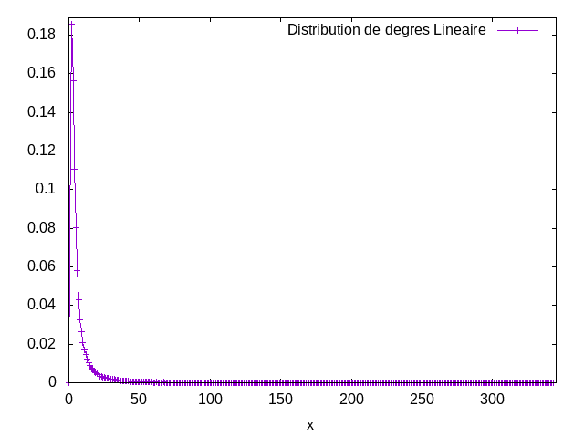
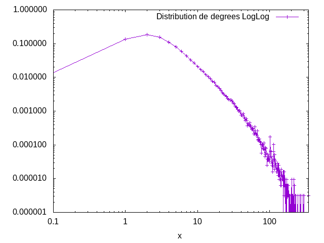
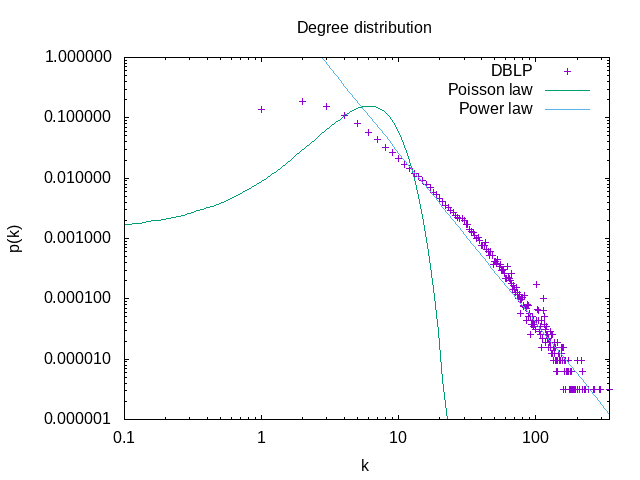
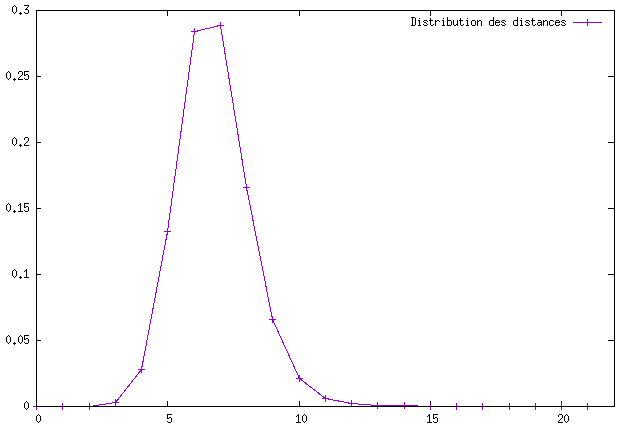
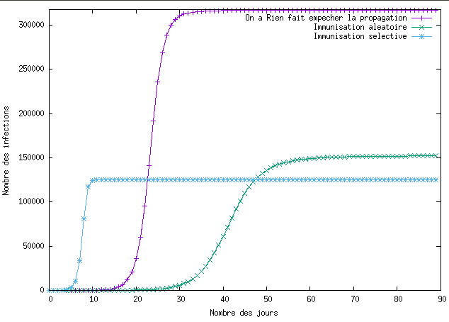
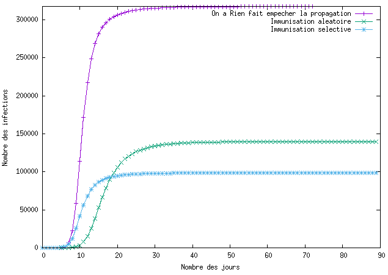

# Paritie 1 : TPMesuresReseauxInteraction
Question 2 : 
------------

Le graphe des collaborations scientifiques possède:
- 317 080 Noeuds
- 1 049 866 Liens
- un degré moyen de 6.62
- un coefficient de clustering de 0.632

Pour un graph aléatoire de la même taille et du même degré moyen le coefficient de clustering est de 3.7022436744750736E-5

Question 3 :
------------
Le graphe est connexe, un graphe aléatoire de  la même taille et du même degré moyen n'est normalement pas connexe car le degré moyen n'est pas supérieur au logarithme de la taille du graphe : ln(taille du graphe=317 080) = 12.66

Question 4 :
------------
La distribution des degrés dans le graphe suit la fonction suivante : 




En traçant la distribution de degrés en échelle log-log on observe une ligne droite pendant plusieurs ordres de grandeur. Cela nous indique une loi de puissance 

```math
p_k = C k^{-\gamma}
```




Question 5:
------------
La distance moyenne pour Le graphe des collaborations scientifiquesest de 8.294

Pour le graph aléatoire de graphStream La distance moyenne est de 7.697



Question 6:
----------

Pour le graphe aléatoire de graphStream nous avons : 
- 317 080 Noeuds
- 1051236 Liens
- un degré moyen de 6.63
- un coefficient de clustering de 4.1571652387454414E-5
- Le graphe n' est pas connexe
- La distance moyenne est de 7.363

Ils ont à peu près le même nombre de liens. Le coefficients de clustering d'un réseau aléatoire est 5 fois plus petit que celui que nous avons. Nous avons un graphe tel que le degré moyen est inférieur au logarithme de la taille du graphe, alors il ne devrait pas être connexe. La distance correspond au graphe de collaboration scientifique, ce qui est la caractéristique des graphe aléatoire. Le Graphe ressemble aux estimations faites excepté pour le clustering.

Pour le graphe Barabasi-Albert nous avons : 
- 317 080 Noeuds
- 1110676 Liens
- un degré moyen de 7.005
- un coefficient de clustering de 4.513878240505551E-4
- Le graphe est connexe
- La distance moyenne est de 6.059

Le graphe de Barabasi-Albert posséde à peu près le même nombre de liens, le degré moyen est le même mais le coefficient de clustering est inférieur. Le coefficient de clustering s'explique par le fait que lors de la création de noeud elle aurra beaucoup plus de chance de se lier avec une composante géante. Pour un haut taux de clustering il faudrait qu'un noeud ait plus de chance de s'atacher au voisin d'une composant géante qu'aux autres composantes géantes.

7 Question Bonus : 
---------------
variante de la méthode de copie avec p=0.5 nous avons : 
- 317 080 Noeuds
- 489546 Liens
- un degré moyen de 6.0
- un coefficient de clustering de 0.07687585480452608
- Le graphe est connexe
- La distance moyenne est de 8.806

Avec cette methode, nous génère un réseau connexe avec un coefficient  de clustering plus petit.
  
# Partie 2 : Propagation
# Question 1:

## taux de propagation du virus : 

```math
\lambda = \frac{\beta}{\mu}
```
```math
 \lambda = \frac{\frac{1}{7}}{\frac{1}{14}}
 ```
## le seuil épidémique : 
```math
\lambda_c = \frac{<k>}{<k^{2}>}
```
### Pour le graph du réseau scientifique

```math
\lambda_c = \frac{6.62}{144.01}
```

```math
\lambda_c = 0.0459
```

### Pour un graph aléatoire :
```math
\lambda_c = \frac{1}{<k> + 1}
```

```math
\lambda_c = \frac{1}{7.62}
```

```math
\lambda_c = 0.13
```
#Question 2:






Lors du scénario sans immunisation les tau tournent tous autour de 80% de contamination, il n'y a donc pas de différence notable à remarquer.

La différence se fait dans le scénario 2 et 3 puisque c'est simulations prouvent l'influence des composantes géantes, l'ont peut voir que le graph scientifique et le graph de Barabási-Albert ont à peu près les mêmes valeurs contrairement au graph aléatoire. En effet celui-ci a très peux de composantes géantes.
#question 3:

##degré moyen des groupe des personnes convaincu du scénario 2 et du scénario 3:

###Pour le graph du réseau scientifique

nombre de noeud groupe 0 158660 degre moyen groupe 0 : 6.6154040085717885
nombre de noeud groupe 1 101930 degre moyen groupe 1 : 11.363288531345042

Le degré moyen du groupe 0 est égal à 6,62 ce qui correspond au degré moyen du graph tandis que le groupe 1 a un degré moyen égal à 11,35. Cette différence s'explique à cause des composantes géantes. En effet il y a peu de chance de saisir une composante géante au hasard, par contre avoir un noeud d'ont le voisin est un une composante géante est plus importante. C'est pour ça qu'il y a une grosse différence de degré moyen de noeud. Ont peut aussi le voir avec le nombre de noeuds du groupe 0 qui est beaucoup plus  important qu le nombre de noeuds du groupe 1, 158660 noeuds pour le groupe 0 et 101930 pour le groupe 1. Il y a donc des noeuds qui ont été rajouté plusieurs fois dans le groupe 1 mais compté une seul fois, ce sont donc des composantes géantes.

###Pour le graph du graph de Barabási-Albert

Le degré moyen du groupe 0 est égal à 6,85 ce qui correspond au degré moyen du graph tandis que le groupe 1 a un degré moyen égal à 14,36. L'explication est la même que celui du graph scientifique.

###Pour un graph aléatoire :

nombre de noeud groupe 0 158552 degre moyen groupe 0 : 6.604438015589272
nombre de noeud groupe 1 121980 degre moyen groupe 1 : 8.272779176914249

Il y a une petite différence car les premiers noeuds ont forcéménts plus de chance d'avoir de noeuds, ont avons donc quelques composantes géantes mais ça ne représente pas une part importante du graph. Ici la différence du nombre de noeuds est plus petite, 158552 pour le groupe 0 et 121980 pour le groupe 1. On peut voir des composantes géantes mais deux fois moins environ que les autres graphes.

#question 4:

##le seuil épidémique du réseau modifié pour le scénario 2 et 3:

###Pour le graph du réseau scientifique

Le seuil épidémique du réseau pour le scénario 2 est de 0.08687670580259488 et celui du scénrio 3 de 0.09095410147983138. L'ont peut voir  une différence grâve au fait que des composantes géantes sont retirés du graph lors du troisième scénario.

###Pour le graph du graph de Barabási-Albert

Le seuil épidémique du réseau pour le scénario 2 est de  0.04722582225685172 et celui du scénrio 3 de 0.05801839733887641. La différence vient du même fénomène, celle-ci est moidre car ce type de graph il y a moins de composantes géantes

###Pour un graph aléatoire :

Le seuil épidémique du réseau pour le scénario 2 est de  0.19506322895995423 et celui du scénrio 3 de 0.18883315404007478. Ici la différence est extrèmement minime car il n'y a quasiment aucune composantes géantes.
