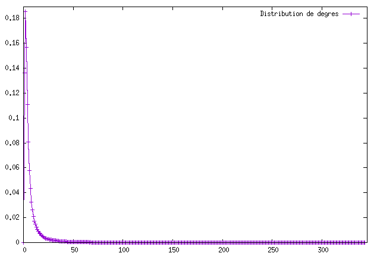
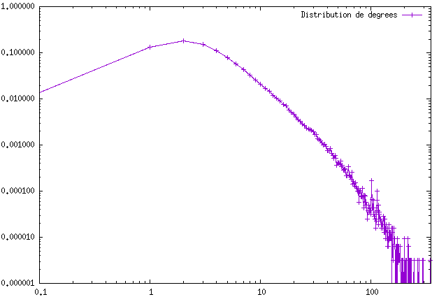
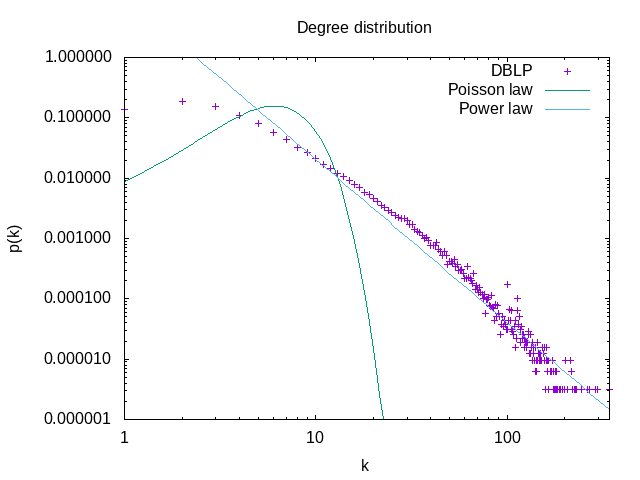

# Paritie 1 : TPMesuresReseauxInteraction
Question 2 : 
------------

Le graphe des collaborations scientifiques possède:
- 317 080 Noeuds
- 1 049 866 Liens
- un degré moyen de 6.62
- un coefficient de clustering de 0.632

Pour un graph aléatoire de la même taille et du même degré moyen le coefficient de clustering est de 3.7022436744750736E-5

Question 3 :
------------
Le graphe est connexe, un graphe aléatoire de  la même taille et du même degré moyen n'est normalement pas connexe car le degré moyen n'est pas supérieur au logarithme de la taille du graphe : ln(taille du graphe=317 080) = 12.66

Question 4 :
------------
La distribution des degrés dans le graphe suit la fonction suivante : 




En traçant la distribution de degrés en échelle log-log on observe une ligne droite pendant plusieurs ordres de grandeur. Cela nous indique une loi de puissance 

```latex
    p_k = C k^{-\gamma}
```



Question 5:
------------
La distance moyenne pour Le graphe des collaborations scientifiquesest de 8.294

Pour le graph aléatoire de graphStream La distance moyenne est de 7.697

Question 6:
----------

Pour le graphe aléatoire de graphStream nous avons : 
- 317 080 Noeuds
- 1051236 Liens
- un degré moyen de 6.63
- un coefficient de clustering de 4.1571652387454414E-5
- Le graphe n' est pas connexe
- La distance moyenne est de 7.363

Ils ont à peu près le même nombre de liens. Le coefficients de clustering d'un réseau aléatoire est 5 fois plus petit que celui que nous avons. Nous avons un graphe tel que le degré moyen est inférieur au logarithme de la taille du graphe, alors il ne devrait pas être connexe. La distance correspond au graphe de collaboration scientifique, ce qui est la caractéristique des graphe aléatoire. Le Graphe ressemble aux estimations faites excepté pour le clustering.

Pour le graphe Barabasi-Albert nous avons : 
- 317 080 Noeuds
- 1110676 Liens
- un degré moyen de 7.005
- un coefficient de clustering de 4.513878240505551E-4
- Le graphe est connexe
- La distance moyenne est de 6.059

Le graphe de Barabasi-Albert posséde à peu près le même nombre de liens, le degré moyen est le même mais le coefficient de clustering est inférieur. Le coefficient de clustering s'explique par le fait que lors de la création de noeud elle aurra beaucoup plus de chance de se lier avec une composante géante. Pour un haut taux de clustering il faudrait qu'un noeud ait plus de chance de s'atacher au voisin d'une composant géante qu'aux autres composantes géantes.

# Partie 2 : Propagation
#Question 1:

##taux de propagation du virus : 

$\lambda = \frac{\beta}{\mu}$
$\lambda = \frac{\frac{1}{7}}{\frac{1}{14}}$

##le seuil épidémique : 

$\lambda_c = \frac{<k>}{<k^{2}>}$

###Pour le graph du réseau scientifique

$\lambda_c = \frac{6.62}{144.01}$
$\lambda_c = 0.0459$

###Pour un graph aléatoire :

$\lambda_c = \frac{1}{<k> + 1}$
$\lambda_c = \frac{1}{7.62}$
$\lambda_c = 0.13$

